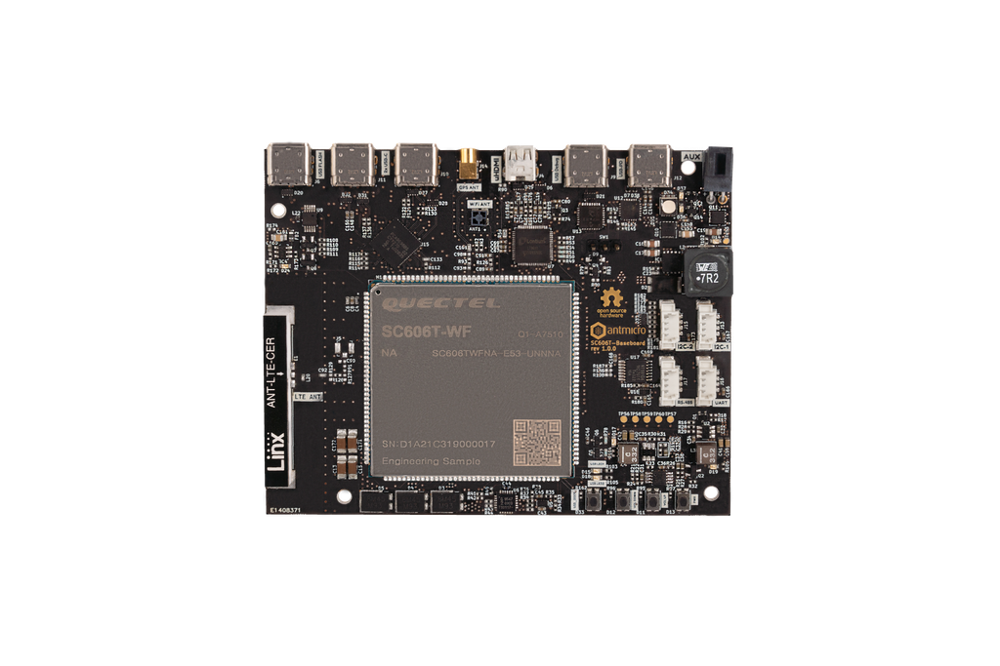

# Antmicro's open source SC606T (Snapdragon 625) Baseboard

Copyright (c) 2022-2024 [Antmicro](https://www.antmicro.com)

## Overview

This repository contains open hardware design files for an experimental development board for Quectel [SC606T Smart Module](https://www.quectel.com/product/lte-sc606t-smart-module-series) featuring Qualcomm [Snapdragon 625 Mobile Platform](https://www.qualcomm.com/products/application/smartphones/snapdragon-6-series-mobile-platforms/snapdragon-625-mobile-platform).
This development board break-routes the relevant I/O interfaces from the smart module keeping a small mechanical outline. 
The design files were prepared in KiCad 7.

## Repository structure

The main repository directory contains KiCad PCB project files, a LICENSE and README.
The remaining files are stored in the following directories:

* `img` - contains graphics for this README
* `doc` - contains schematics in PDF format
* `assets` - contains visual assets for showcasing this design on [Open Hardware Portal](https://openhardware.antmicro.com).

## Key Features

* Quectel SC606T Smart Module with Qualcomm Snapdragon 625
* Built-in Dual-Band WiFi and Bluetooth
* Built-in Cat 6 LTE modem with multi-constellation GNSS receiver
* HDMI output implemented with on-board DSI-HDMI bridge
* DSI interface exposed on Flexible Flat Cable (FFC) connector
* USB 3.0 (Type-C) connector supporting host/otg mode
* 2x 4-lane MIPI CSI-2 camera interface

The board supports multiple power supply scenarios including:

* USB-C PD (Power Delivery)
* External PSU or battery

The on-board camera connector is electrically compatible with several video accessories created by Antmicro such as:
 
* [OV9281 Dual Camera Board](https://github.com/antmicro/ov9281-camera-board)
* [SDI-MIPI bridge](https://github.com/antmicro/sdi-mipi-bridge)
* [HDMI-MIPI bridge](https://github.com/antmicro/hdmi-mipi-bridge)

## License

[Apache-2.0](LICENSE)
